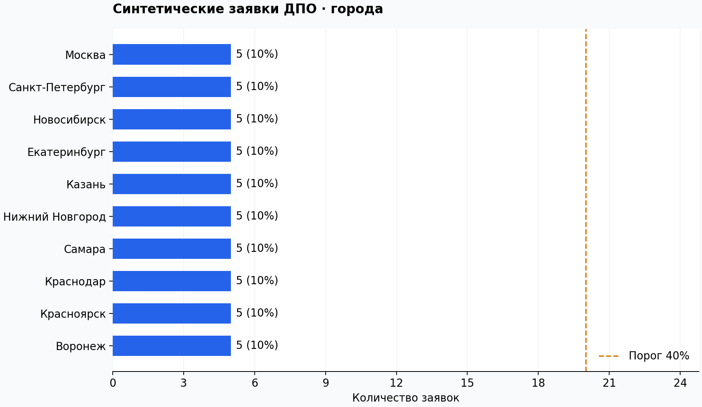
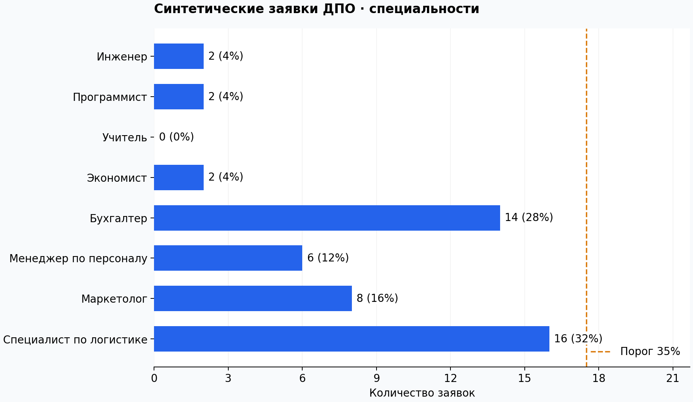

# Практическое применение генеративного ИИ

Форк [репозитория курса](https://github.com/paNikitin/gen-ai) с выполненными лабораторными работами.

## Лабораторная № 1 — синтетические заявки на курсы ДПО

[Код, результаты и инструкция](lab1_verified/README.md).

Генерация выполнена 19.09.2026 через DeepSeek API. Основной набор содержит 50 валидных заявок: по 5 на каждый из 10 городов. Максимальная доля специальности — 32% при пороге 35%. Для сравнения сохранён отдельный случайный прогон из 50 заявок.

- [Итоговые заявки CSV](lab1_verified/lab1_dpo/output/stratified/applications.csv)
- [Выводы](lab1_verified/lab1_dpo/output/stratified/выводы.md)
- [Сравнение стратегий](lab1_verified/lab1_dpo/output/stratified/comparison.md)
- [Проверка результатов](lab1_verified/VERIFICATION.md)

## Лабораторная № 2 — текстовый конвейер

[Код, корпус отзывов и инструкция запуска](lab2_text/README.md).

**API-прогон завершён, отчёт доработан.** Обработаны 30 синтетических отзывов: 30 валидных объектов, ghost-цитат 0 из 355 проверок, overall_score = **0,8135**. Реализованы IE, анализ шести аспектов, параллельный Map-Reduce, LLM-as-judge и autodiscovery. В выводах разобраны два случая потери контекста, вердикт A3 и два кандидата в новые аспекты.

- [Выводы](lab2_text/выводы.md)
- [Отчёт PDF, 2 страницы](lab2_text/lab2_report.pdf)
- [Артефакты и журналы API](lab2_text/output/README.md)
- [Протокол проверки](lab2_text/VALIDATION.md)
- [Полный комплект второй лабораторной ZIP](lab2_final.zip)

Для просмотра результатов и проверки файлов ключ не нужен. Новые эксперименты на Windows запускаются из папки `lab2_text` через **RUN_LAB2.cmd**.

## Лабораторная № 3 — RAG и сравнение чанкинга

[Код, корпус, локальные измерения и инструкция запуска](lab3_rag/README.md).

**Подготовлена к API-прогону.** Поиск уже измерен локально: 5 документов, 30 вопросов, hit-rate@5 = 0,9000 для обеих стратегий. Сравниваются блоки по 2000 символов без перекрытия и разбиение по границам текста с окном 800 и перекрытием 120. Различия состава контекста разобраны отдельно от основной метрики. 13 локальных тестов пройдены; ответы DeepSeek ещё не получены.

На Windows запуск из папки `lab3_rag`: **RUN_LAB3.cmd**. После второй работы сценарий может скопировать её локальный `.env`; секрет в репозитории не хранится. Третья работа получит ответы для обеих стратегий, проверит цитаты и соберёт `lab3_results.zip`.

## Материалы курса

Исходные материалы преподавателя находятся в папках `семинар_1`–`семинар_6` и `финальный_проект`.

